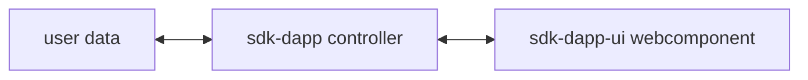
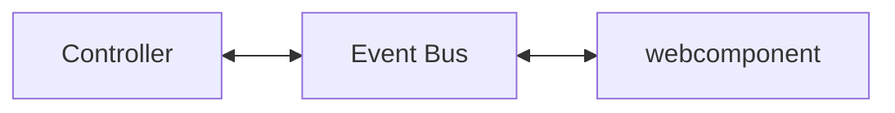

# MultiversX UI library for Front-End DApps

MultiversX Front-End Library for JavaScript and TypeScript (written in TypeScript).

## Introduction

`sdk-dapp-ui` is a library that holds components to display user information from the MultiversX blockchain.

Since the library is built using [Stencil](https://stenciljs.com/), it can be used in any front-end framework, such as React, Angular, or Vue, but also in back-end frameworks like Next.js.

## GitHub project
The GitHub repository can be found here: [https://github.com/multiversx/mx-sdk-dapp-ui](https://github.com/multiversx/mx-sdk-dapp-ui)

## Live demo: template-dapp
See [Template dApp](https://template-dapp.multiversx.com/) for live demo or checkout usage in the [Github repo](https://github.com/multiversx/mx-template-dapp)


## Requirements
- Node.js version 20.13.1+
- Npm version 10.5.2+

## Distribution

[npm](https://www.npmjs.com/package/@multiversx/sdk-dapp-ui)

## Installation

The library can be installed via npm or yarn.

```bash
npm install @multiversx/sdk-dapp-ui
```

or

```bash
yarn add @multiversx/sdk-dapp-ui
```

## Usage

`sdk-dapp-ui` library is primarily designed to work with [@multiversx/sdk-dapp](https://www.npmjs.com/package/@multiversx/sdk-dapp), since components are designed to display data and emit user events, but do not hold any business logic.

The library is divided into three main categories:
There are three types of components in the library: 
1. The ones that only display data (visual) 
2. The ones that display data provided by a controller (controlled)
3. The ones that are designed for user interaction (functional). 

Below we will detail these categories:

### 1. Visual components

The basic usage of the component would be importing the component and its corresponding interface and creating a wrapper for it in your application.

React example where the component does not need any processed data:

```tsx
import type { CopyButton as CopyButtonPropsType } from '@multiversx/sdk-dapp-ui/dist/types/components/visual/copy-button/copy-button.d.ts';
export { CopyButton as ReactCopyButton } from '@multiversx/sdk-dapp-ui/react';

export const CopyButton = (props: CopyButtonPropsType) => {
  return <ReactCopyButton {...props} />;
};
```

### 2. Controlled components

Controlled components are designed to display data that is processed by a controller. The controller is responsible for processing the data and providing it to the component.

A typycal flow of data would be:



Vanilla example where the component makes use of a controller from `sdk-dapp`:

```tsx
export { FormatAmountController } from "@multiversx/sdk-dapp/out/controllers/FormatAmountController";
import { DIGITS, DECIMALS } from "@multiversx/sdk-dapp-utils/out/constants";


export const FormatAmount = (props: {
  egldLabel?: string;
  value: string;
}) => {
  const { isValid, valueDecimal, valueInteger, label } =
    FormatAmountController.getData({
      digits: DIGITS,
      decimals: DECIMALS,
      ...props,
      input: props.value
    });

  return (
    <format-amount
      class={props.class}
      data-testid={props["data-testid"]}
      isValid={isValid}
      label={label}
      valueDecimal={valueDecimal}
      valueInteger={valueInteger}
    />
  );
};
```


### 3. Functional components

Functional components in the `sdk-dapp-ui` library are designed to create interactive UIs and handle user events effectively. Typically, these components are embedded in login or signing transactions flows. They typically leverage the functionality provided by the `@multiversx/sdk-dapp` library to manage state and actions.

The way functional components are controlled are trough a [pub-sub pattern](https://en.wikipedia.org/wiki/Publish%E2%80%93subscribe_pattern) called EventBus. Each webcomponent has a method of exposing its EventBus, thus allowing sdk-dapp to get a reference to it and use it for communication.



```typescript
const modalElement = await createUIElement<LedgerConnectModal>(
  'ledger-connect-modal'
);
const eventBus = await modalElement.getEventBus();
eventBus.publish('TRANSACTION_TOAST_DATA_UPDATE', someData);
```

If you need to have a custom implementation of a functional component, you have to follow some simple steps:

- design a UI component that has a method called `getEventBus`, implementing the `IEventBus` interface found in `src/utils/EventBus.ts`
- make sure to implement the same interfaces as the original component. For example, if overriding the `ledger-connect-modal`, you can find the interfaces in `src/components/ledger-connect-modal/ledger-connect-modal.types.ts`

## Debugging your dApp

The recommended way to debug your application is by using [lerna](https://lerna.js.org/). Make sure you have the same package version in sdk-daap-core's package.json and in your project's package.json.

If you preffer to use [npm link](https://docs.npmjs.com/cli/v11/commands/npm-link), make sure to use the `preserveSymlinks` option in the server configuration:

```js
  resolve: {
    preserveSymlinks: true, // 👈
    alias: {
      src: "/src",
    },
  },
```

To build the library, run:

```bash
npm run build
```

To run the unit tests, run:

```bash
npm test
```

