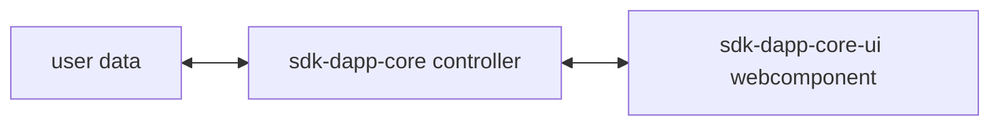

# MultiversX UI library for Front-End DApps

MultiversX Front-End Library for JavaScript and TypeScript (written in TypeScript).

## Introduction

`sdk-dapp-core-ui` is a library that holds components to display user information from the MultiversX blockchain.

Since the library is built using [Stencil](https://stenciljs.com/), it can be used in any front-end framework, such as React, Angular, or Vue, but also in back-end frameworks like Next.js.

## GitHub project
The GitHub repository can be found here: [https://github.com/multiversx/mx-sdk-dapp-core-ui](https://github.com/multiversx/mx-sdk-dapp-core-ui)

## Live demo: template-dapp
See [Template dApp](https://template-dapp.multiversx.com/) for live demo or checkout usage in the [Github repo](https://github.com/multiversx/mx-template-dapp)


## Requirements
- Node.js version 20.13.1+
- Npm version 10.5.2+

## Distribution

[npm](https://www.npmjs.com/package/@multiversx/sdk-dapp-core-ui)

## Installation

The library can be installed via npm or yarn.

```bash
npm install @multiversx/sdk-dapp-core-ui
```

or

```bash
yarn add @multiversx/sdk-dapp-core-ui
```

## Usage

`sdk-dapp-core-ui` library is primarily designed to work with [@multiversx/sdk-dapp-core](https://www.npmjs.com/package/@multiversx/sdk-dapp-core), since components are designed to display data and emit user events, but do not hold any business logic.

A typycal flow of data would be:



There are two types of components in the library, ones that only display data and others that are designed for user interaction. Typically, the components that include user interaction are embedded in login or signing transactions flows from `sdk-dapp-core`. Below we will detail both categories, with accent on the first one.

### Display components