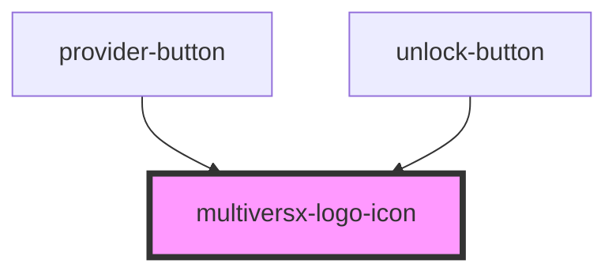

# xportal-provider-icon

<!-- Auto Generated Below -->

## Dependencies

### Used by

 - [provider-button](../../../components/visual/unlock-panel/components/provider-button)
 - [unlock-button](../../../common/unlock-button)

### Graph

----------------------------------------------

*Built with [StencilJS](https://stenciljs.com/)*
