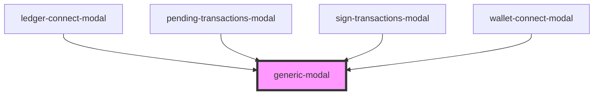

# generic-modal

<!-- Auto Generated Below -->

## Properties

| Property        | Attribute        | Description | Type              | Default     |
| --------------- | ---------------- | ----------- | ----------------- | ----------- |
| `body`          | --               |             | `VNode`           | `undefined` |
| `modalSubtitle` | `modal-subtitle` |             | `VNode \| string` | `undefined` |
| `modalTitle`    | `modal-title`    |             | `VNode \| string` | `undefined` |

## Events

| Event   | Description | Type                |
| ------- | ----------- | ------------------- |
| `close` |             | `CustomEvent<void>` |

## Dependencies

### Used by

 - [ledger-connect-modal](../../components/controlled/ledger-connect-modal)
 - [pending-transactions-modal](../../components/controlled/pending-transactions-modal)
 - [sign-transactions-modal](../../components/controlled/sign-transactions-modal)
 - [wallet-connect-modal](../../components/controlled/wallet-connect-modal)

### Graph

----------------------------------------------

*Built with [StencilJS](https://stenciljs.com/)*
