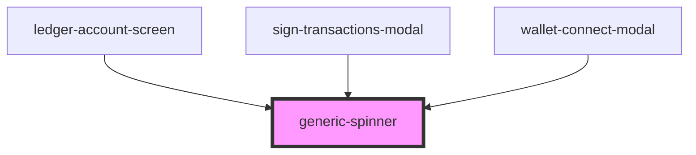

# generic-spinner

<!-- Auto Generated Below -->

## Dependencies

### Used by

 - [ledger-account-screen](../../components/functional/ledger-connect-components/components/ledger-account-screen)
 - [sign-transactions-modal](../../components/functional/sign-transactions-modal)
 - [wallet-connect-modal](../../components/functional/wallet-connect-components)

### Graph

----------------------------------------------

*Built with [StencilJS](https://stenciljs.com/)*
