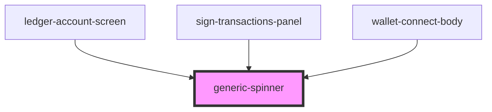

# generic-spinner

<!-- Auto Generated Below -->

## Dependencies

### Used by

 - [ledger-account-screen](../../components/functional/ledger-connect-components/components/ledger-account-screen)
 - [sign-transactions-panel](../../components/functional/sign-transactions-panel)
 - [wallet-connect-body](../../components/functional/wallet-connect-components/components)

### Graph

----------------------------------------------

*Built with [StencilJS](https://stenciljs.com/)*
