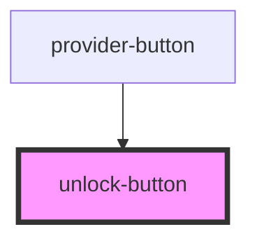

# unlock-button

<!-- Auto Generated Below -->

## Properties

| Property | Attribute | Description | Type          | Default     |
| -------- | --------- | ----------- | ------------- | ----------- |
| `icon`   | --        |             | `HTMLElement` | `undefined` |
| `label`  | `label`   |             | `string`      | `undefined` |

## Dependencies

### Used by

 - [provider-button](../../components/unlock-panel/components/provider-button)

### Graph

----------------------------------------------

*Built with [StencilJS](https://stenciljs.com/)*
