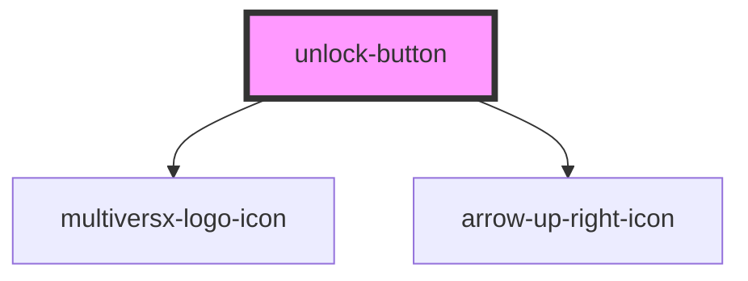

# unlock-button

<!-- Auto Generated Below -->

## Properties

| Property      | Attribute      | Description | Type                                                                                                                                                                                                          | Default     |
| ------------- | -------------- | ----------- | ------------------------------------------------------------------------------------------------------------------------------------------------------------------------------------------------------------- | ----------- |
| `buttonIcon`  | --             |             | `HTMLElement`                                                                                                                                                                                                 | `undefined` |
| `buttonLabel` | `button-label` |             | `string`                                                                                                                                                                                                      | `undefined` |
| `buttonType`  | `button-type`  |             | `ProviderTypeEnum.crossWindow \| ProviderTypeEnum.extension \| ProviderTypeEnum.ledger \| ProviderTypeEnum.metamask \| ProviderTypeEnum.passkey \| ProviderTypeEnum.walletConnect \| ProviderTypeEnum.xalias` | `undefined` |
| `class`       | `class`        |             | `string`                                                                                                                                                                                                      | `undefined` |

## Dependencies

### Depends on

- [multiversx-logo-icon](../../assets/icons/multiversx-logo-icon)
- [arrow-up-right-icon](../../assets/icons/arrow-up-right-icon)

### Graph

----------------------------------------------

*Built with [StencilJS](https://stenciljs.com/)*
