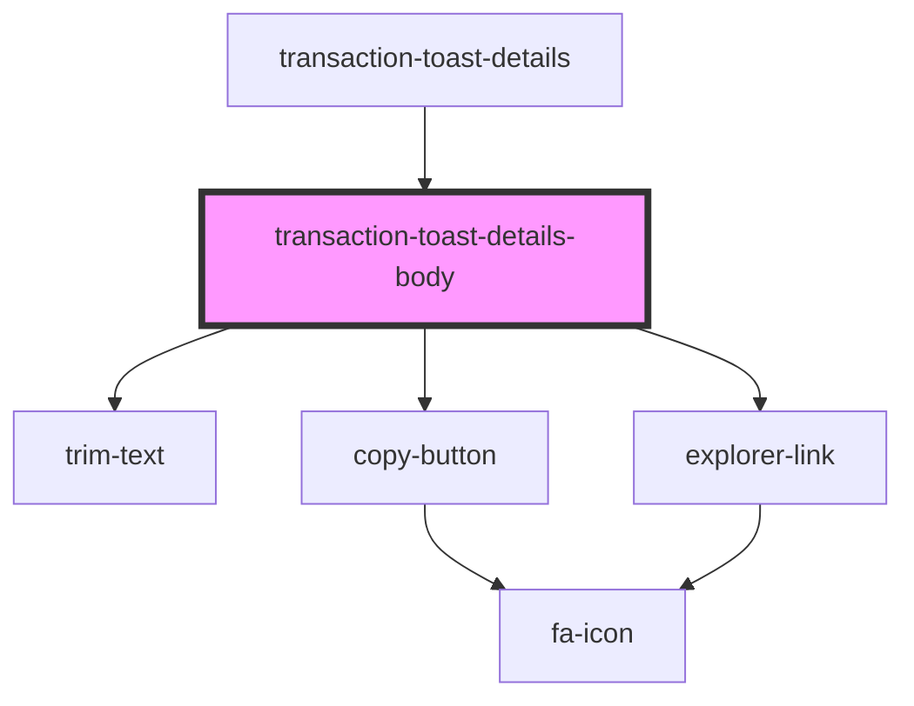

# transaction-toast-details-body

<!-- Auto Generated Below -->

## Properties

| Property           | Attribute           | Description | Type     | Default                   |
| ------------------ | ------------------- | ----------- | -------- | ------------------------- |
| `hash`             | `hash`              |             | `string` | `undefined`               |
| `link`             | `link`              |             | `string` | `undefined`               |
| `status`           | `status`            |             | `string` | `undefined`               |
| `transactionClass` | `transaction-class` |             | `string` | `'transaction-container'` |

## Dependencies

### Used by

 - [transaction-toast-details](..)

### Depends on

- [trim-text](../../../../../../../visual/trim)
- [copy-button](../../../../../../../functional/copy-button)
- [explorer-link](../../../../../../../visual/explorer-link)

### Graph

----------------------------------------------

*Built with [StencilJS](https://stenciljs.com/)*
