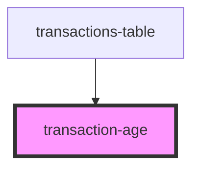

# my-component

<!-- Auto Generated Below -->

## Properties

| Property  | Attribute | Description | Type     | Default     |
| --------- | --------- | ----------- | -------- | ----------- |
| `age`     | `age`     |             | `string` | `undefined` |
| `class`   | `class`   |             | `string` | `undefined` |
| `tooltip` | `tooltip` |             | `string` | `undefined` |

## Dependencies

### Used by

 - [transactions-table](../..)

### Graph

----------------------------------------------

*Built with [StencilJS](https://stenciljs.com/)*
