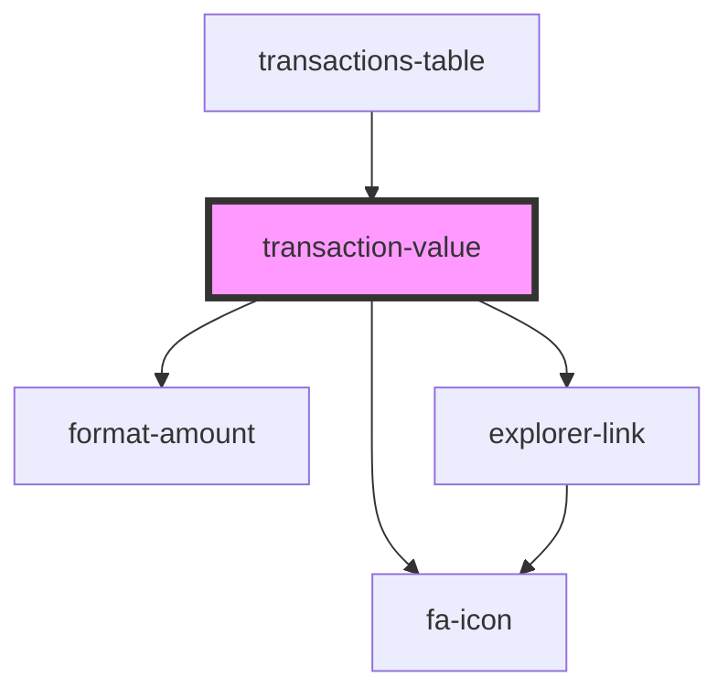

# transaction-value

<!-- Auto Generated Below -->

## Properties

| Property | Attribute | Description | Type                | Default     |
| -------- | --------- | ----------- | ------------------- | ----------- |
| `class`  | `class`   |             | `string`            | `undefined` |
| `value`  | --        |             | `ITransactionValue` | `undefined` |

## Dependencies

### Used by

 - [transactions-table](../..)

### Depends on

- [format-amount](../../../format-amount)
- [explorer-link](../../../../visual/explorer-link)
- [fa-icon](../../../../visual/fa-icon)

### Graph

----------------------------------------------

*Built with [StencilJS](https://stenciljs.com/)*
