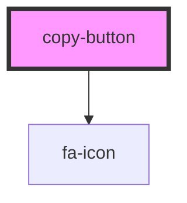

# copy-button

<!-- Auto Generated Below -->

## Properties

| Property      | Attribute | Description | Type             | Default         |
| ------------- | --------- | ----------- | ---------------- | --------------- |
| `class`       | `class`   |             | `string`         | `'copy-button'` |
| `copyIcon`    | --        |             | `IconDefinition` | `faCopy`        |
| `successIcon` | --        |             | `IconDefinition` | `faCheck`       |
| `text`        | `text`    |             | `string`         | `undefined`     |

## Dependencies

### Depends on

- [fa-icon](../fa-icon)

### Graph

----------------------------------------------

*Built with [StencilJS](https://stenciljs.com/)*
