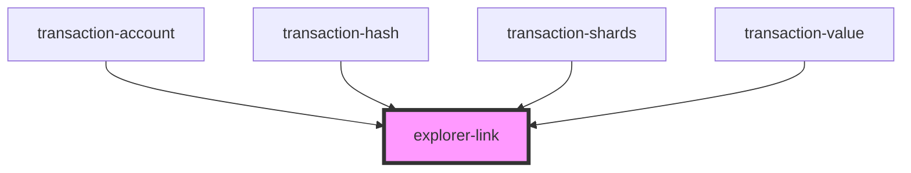

# explorer-link

<!-- Auto Generated Below -->

## Properties

| Property     | Attribute      | Description | Type             | Default           |
| ------------ | -------------- | ----------- | ---------------- | ----------------- |
| `class`      | `class`        |             | `string`         | `'explorer-link'` |
| `dataTestId` | `data-test-id` |             | `string`         | `undefined`       |
| `icon`       | --             |             | `IconDefinition` | `undefined`       |
| `link`       | `link`         |             | `string`         | `undefined`       |
| `text`       | `text`         |             | `string`         | `undefined`       |

## Dependencies

### Used by

 - [transaction-account](../transactions-table/components/transaction-account)
 - [transaction-hash](../transactions-table/components/transaction-hash)
 - [transaction-shards](../transactions-table/components/transaction-shards)
 - [transaction-value](../transactions-table/components/transaction-value)

### Graph

----------------------------------------------

*Built with [StencilJS](https://stenciljs.com/)*
