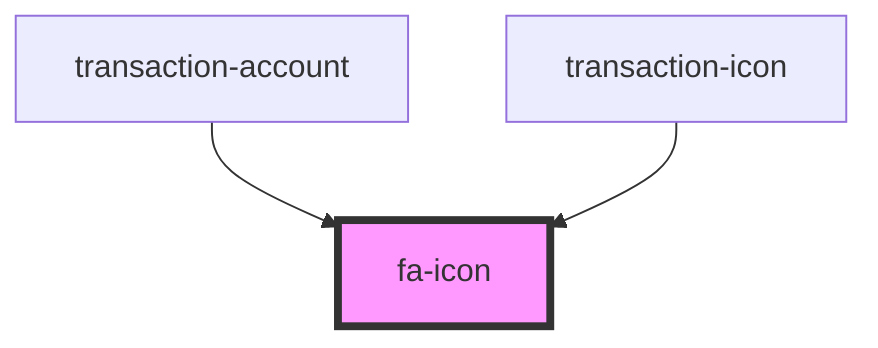

# fa-icon

<!-- Auto Generated Below -->

## Properties

| Property      | Attribute     | Description | Type             | Default              |
| ------------- | ------------- | ----------- | ---------------- | -------------------- |
| `class`       | `class`       |             | `string`         | `'fa-icon'` |
| `description` | `description` |             | `string`         | `undefined`          |
| `icon`        | --            |             | `IconDefinition` | `undefined`          |

## Dependencies

### Used by

 - [transaction-account](../transactions-table/components/transaction-account)
 - [transaction-icon](../transactions-table/components/transaction-icon)

### Graph

----------------------------------------------

*Built with [StencilJS](https://stenciljs.com/)*
