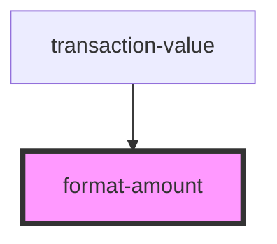

# format-amount

<!-- Auto Generated Below -->

## Properties

| Property       | Attribute       | Description | Type      | Default                                 |
| -------------- | --------------- | ----------- | --------- | --------------------------------------- |
| `class`        | `class`         |             | `string`  | `undefined`                             |
| `dataTestId`   | `data-test-id`  |             | `string`  | `DataTestIdsEnum.formatAmountComponent` |
| `isValid`      | `is-valid`      |             | `boolean` | `undefined`                             |
| `label`        | `label`         |             | `string`  | `undefined`                             |
| `labelClass`   | `label-class`   |             | `string`  | `undefined`                             |
| `valueDecimal` | `value-decimal` |             | `string`  | `undefined`                             |
| `valueInteger` | `value-integer` |             | `string`  | `undefined`                             |

## Dependencies

### Used by

 - [transaction-value](../transactions-table/components/transaction-value)

### Graph

----------------------------------------------

*Built with [StencilJS](https://stenciljs.com/)*
