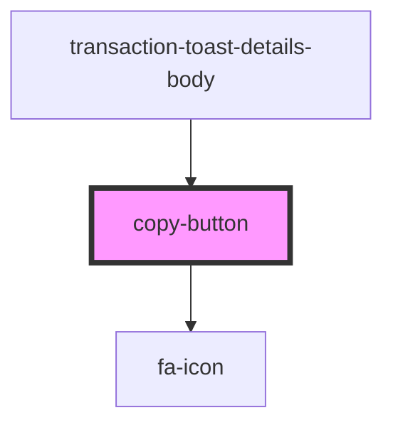

# copy-button

<!-- Auto Generated Below -->

## Properties

| Property      | Attribute | Description | Type             | Default     |
| ------------- | --------- | ----------- | ---------------- | ----------- |
| `class`       | `class`   |             | `string`         | `undefined` |
| `copyIcon`    | --        |             | `IconDefinition` | `undefined` |
| `successIcon` | --        |             | `IconDefinition` | `undefined` |
| `text`        | `text`    |             | `string`         | `undefined` |

## Dependencies

### Used by

 - [transaction-toast-details-body](../../controlled/toasts-list/components/transaction-toast/components/transaction-toast-details/components)

### Depends on

- [fa-icon](../../visual/fa-icon)

### Graph

----------------------------------------------

*Built with [StencilJS](https://stenciljs.com/)*
