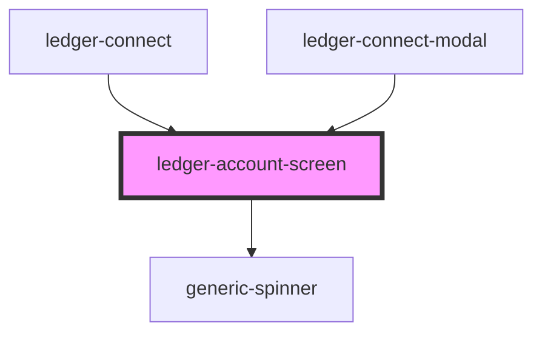

# ledger-account-screen

<!-- Auto Generated Below -->

## Properties

| Property            | Attribute        | Description | Type                 | Default     |
| ------------------- | ---------------- | ----------- | -------------------- | ----------- |
| `accountScreenData` | --               |             | `IAccountScreenData` | `undefined` |
| `selectedIndex`     | `selected-index` |             | `number`             | `undefined` |

## Events

| Event           | Description | Type               |
| --------------- | ----------- | ------------------ |
| `accessWallet`  |             | `CustomEvent<any>` |
| `nextPage`      |             | `CustomEvent<any>` |
| `prevPage`      |             | `CustomEvent<any>` |
| `selectAccount` |             | `CustomEvent<any>` |

## Dependencies

### Used by

 - [ledger-connect](../..)
 - [ledger-connect-modal](../..)

### Depends on

- [generic-spinner](../../../../../common/generic-spinner)

### Graph

----------------------------------------------

*Built with [StencilJS](https://stenciljs.com/)*
