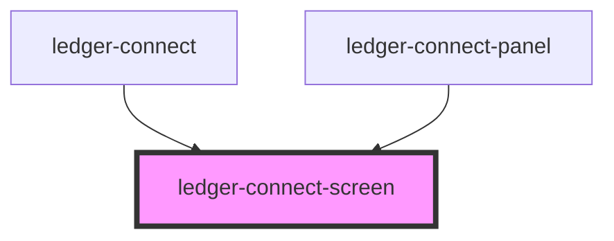

# ledger-connect-screen

<!-- Auto Generated Below -->

## Properties

| Property            | Attribute | Description | Type                 | Default     |
| ------------------- | --------- | ----------- | -------------------- | ----------- |
| `connectScreenData` | --        |             | `IConnectScreenData` | `undefined` |

## Events

| Event     | Description | Type               |
| --------- | ----------- | ------------------ |
| `connect` |             | `CustomEvent<any>` |

## Dependencies

### Used by

 - [ledger-connect](../..)
 - [ledger-connect-panel](../..)

### Graph

----------------------------------------------

*Built with [StencilJS](https://stenciljs.com/)*
