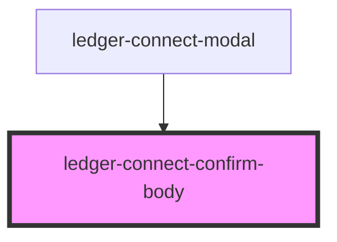

# ledger-connect-confirm-body

<!-- Auto Generated Below -->

## Properties

| Property            | Attribute | Description | Type                 | Default     |
| ------------------- | --------- | ----------- | -------------------- | ----------- |
| `confirmScreenData` | --        |             | `IConfirmScreenData` | `undefined` |

## Dependencies

### Used by

 - [ledger-connect-modal](..)

### Graph

----------------------------------------------

*Built with [StencilJS](https://stenciljs.com/)*
