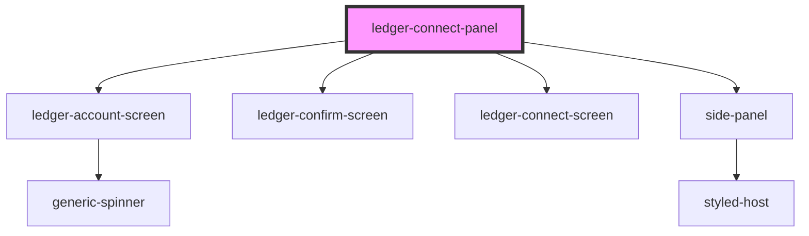

# ledger-connect-modal

<!-- Auto Generated Below -->

## Properties

| Property | Attribute | Description | Type                      | Default                                                                                      |
| -------- | --------- | ----------- | ------------------------- | -------------------------------------------------------------------------------------------- |
| `data`   | --        |             | `ILedgerConnectPanelData` | `{     accountScreenData: null,     confirmScreenData: null,     connectScreenData: {},   }` |

## Methods

### `getEventBus() => Promise<IEventBus>`

#### Returns

Type: `Promise<IEventBus>`

## Dependencies

### Depends on

- [ledger-account-screen](./components/ledger-account-screen)
- [ledger-confirm-screen](./components/ledger-confirm-screen)
- [ledger-connect-screen](./components/ledger-connect-screen)
- [side-panel](../../visual/side-panel)

### Graph

----------------------------------------------

*Built with [StencilJS](https://stenciljs.com/)*
