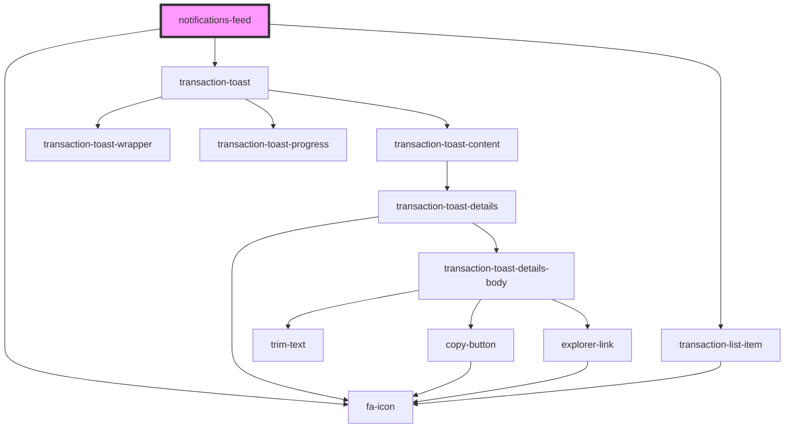

# notifications-feed

<!-- Auto Generated Below -->

## Methods

### `getEventBus() => Promise<IEventBus>`

#### Returns

Type: `Promise<IEventBus>`

## Dependencies

### Depends on

- [fa-icon](../../visual/fa-icon)
- [transaction-toast](../toasts-list/components/transaction-toast)
- [transaction-list-item](../../visual/transaction-list-item)

### Graph

----------------------------------------------

*Built with [StencilJS](https://stenciljs.com/)*
