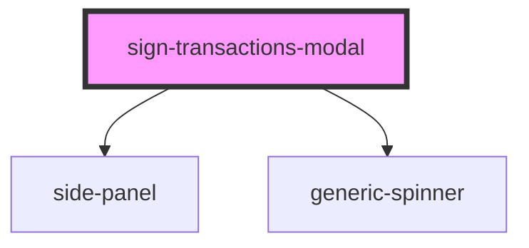

# ledger-connect-modal

<!-- Auto Generated Below -->

## Properties

| Property | Attribute | Description | Type                         | Default                                                                                                                                                                                                                                |
| -------- | --------- | ----------- | ---------------------------- | -------------------------------------------------------------------------------------------------------------------------------------------------------------------------------------------------------------------------------------- |
| `data`   | --        |             | `ISignTransactionsModalData` | `{     commonData: {       egldLabel: '',       feeLimit: '',       feeInFiatLimit: '',       transactionsCount: 0,       currentIndex: 0,     },     tokenTransaction: null,     nftTransaction: null,     sftTransaction: null,   }` |

## Methods

### `getEventBus() => Promise<IEventBus>`

#### Returns

Type: `Promise<IEventBus>`

## Dependencies

### Depends on

- [side-panel](../../visual/side-panel)
- [generic-spinner](../../../common/generic-spinner)

### Graph

----------------------------------------------

*Built with [StencilJS](https://stenciljs.com/)*
