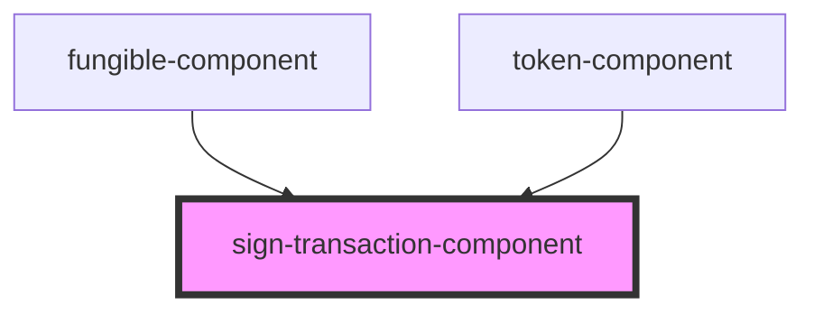

# sign-transaction

<!-- Auto Generated Below -->

## Properties

| Property | Attribute | Description | Type    | Default     |
| -------- | --------- | ----------- | ------- | ----------- |
| `header` | --        |             | `VNode` | `undefined` |

## Dependencies

### Used by

 - [fungible-component](../fungible-component)
 - [token-component](../token-component)

### Graph

----------------------------------------------

*Built with [StencilJS](https://stenciljs.com/)*
