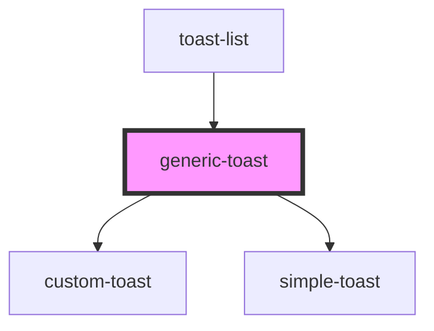

# custom-toast

<!-- Auto Generated Below -->

## Properties

| Property | Attribute | Description | Type                              | Default     |
| -------- | --------- | ----------- | --------------------------------- | ----------- |
| `toast`  | --        |             | `IComponentToast \| ISimpleToast` | `undefined` |

## Events

| Event         | Description | Type                  |
| ------------- | ----------- | --------------------- |
| `deleteToast` |             | `CustomEvent<string>` |

## Dependencies

### Used by

 - [toast-list](../..)

### Depends on

- [custom-toast](./components/custom-create-toast)
- [simple-toast](./components/simple-toast)

### Graph

----------------------------------------------

*Built with [StencilJS](https://stenciljs.com/)*
