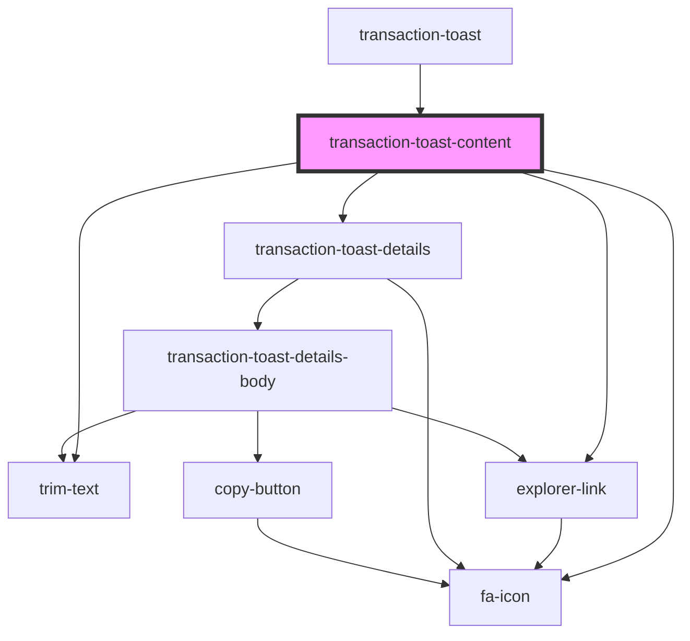

# transaction-toast-content

<!-- Auto Generated Below -->

## Properties

| Property                      | Attribute                       | Description | Type                     | Default     |
| ----------------------------- | ------------------------------- | ----------- | ------------------------ | ----------- |
| `processedTransactionsStatus` | `processed-transactions-status` |             | `Element \| string`      | `undefined` |
| `toastDataState`              | --                              |             | `IToastDataState`        | `undefined` |
| `transactions`                | --                              |             | `ITransactionListItem[]` | `undefined` |

## Events

| Event         | Description | Type                |
| ------------- | ----------- | ------------------- |
| `deleteToast` |             | `CustomEvent<void>` |

## Dependencies

### Used by

 - [transaction-toast](../..)

### Depends on

- [fa-icon](../../../../../../visual/fa-icon)
- [trim-text](../../../../../../visual/trim)
- [explorer-link](../../../../../../visual/explorer-link)
- [transaction-toast-details](../transaction-toast-details)

### Graph

----------------------------------------------

*Built with [StencilJS](https://stenciljs.com/)*
