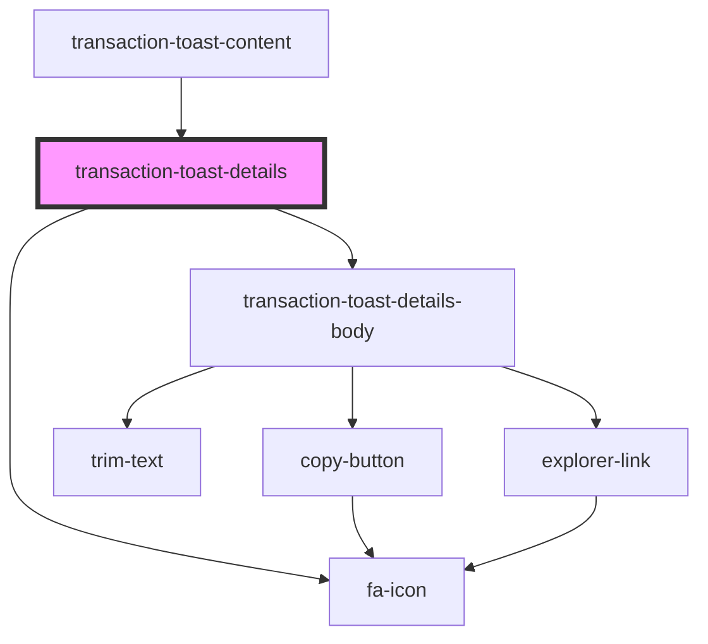

# transaction-toast-details

<!-- Auto Generated Below -->

## Properties

| Property                      | Attribute                       | Description | Type                     | Default     |
| ----------------------------- | ------------------------------- | ----------- | ------------------------ | ----------- |
| `maxShownTransactions`        | `max-shown-transactions`        |             | `number`                 | `5`         |
| `processedTransactionsStatus` | `processed-transactions-status` |             | `Element \| string`      | `undefined` |
| `transactionClass`            | `transaction-class`             |             | `string`                 | `undefined` |
| `transactions`                | --                              |             | `ITransactionListItem[]` | `undefined` |

## Dependencies

### Used by

 - [transaction-toast-content](../transaction-toast-content)

### Depends on

- [fa-icon](../../../../../../visual/fa-icon)
- [transaction-toast-details-body](components)

### Graph

----------------------------------------------

*Built with [StencilJS](https://stenciljs.com/)*
