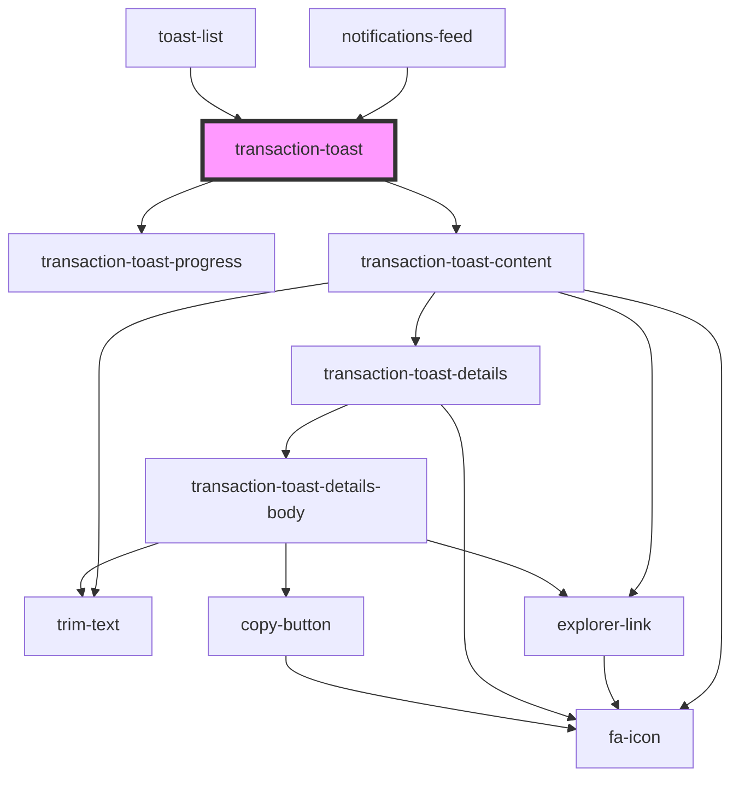

# transaction-toast

<!-- Auto Generated Below -->

## Properties

| Property                      | Attribute                       | Description | Type                        | Default     |
| ----------------------------- | ------------------------------- | ----------- | --------------------------- | ----------- |
| `fullWidth`                   | `full-width`                    |             | `boolean`                   | `undefined` |
| `processedTransactionsStatus` | `processed-transactions-status` |             | `Element \| string`         | `''`        |
| `toastDataState`              | --                              |             | `IToastDataState`           | `undefined` |
| `toastId`                     | `toast-id`                      |             | `string`                    | `''`        |
| `transactionProgressState`    | --                              |             | `ITransactionProgressState` | `undefined` |
| `transactions`                | --                              |             | `ITransactionListItem[]`    | `[]`        |
| `wrapperClass`                | `wrapper-class`                 |             | `string`                    | `undefined` |

## Events

| Event         | Description | Type                |
| ------------- | ----------- | ------------------- |
| `deleteToast` |             | `CustomEvent<void>` |

## Dependencies

### Used by

 - [notifications-feed](../../../notifications-feed)
 - [toast-list](../..)

### Depends on

- [transaction-toast-progress](./components/transaction-toast-progress)
- [transaction-toast-content](./components/transaction-toast-content)

### Graph

----------------------------------------------

*Built with [StencilJS](https://stenciljs.com/)*
