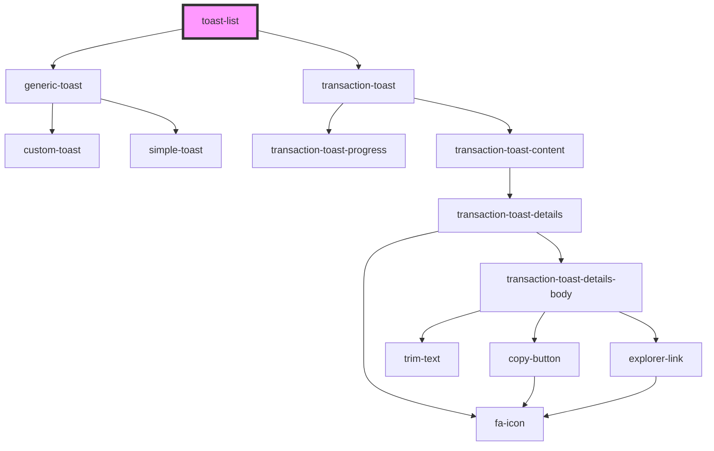

# transaction-toast-list

<!-- Auto Generated Below -->

## Properties

| Property            | Attribute | Description | Type                  | Default     |
| ------------------- | --------- | ----------- | --------------------- | ----------- |
| `customToasts`      | --        |             | `CustomToastType[]`   | `undefined` |
| `transactionToasts` | --        |             | `ITransactionToast[]` | `undefined` |

## Methods

### `getEventBus() => Promise<IEventBus>`

#### Returns

Type: `Promise<IEventBus>`

## Dependencies

### Depends on

- [generic-toast](./components/custom-toast)
- [transaction-toast](./components/transaction-toast)

### Graph

----------------------------------------------

*Built with [StencilJS](https://stenciljs.com/)*
