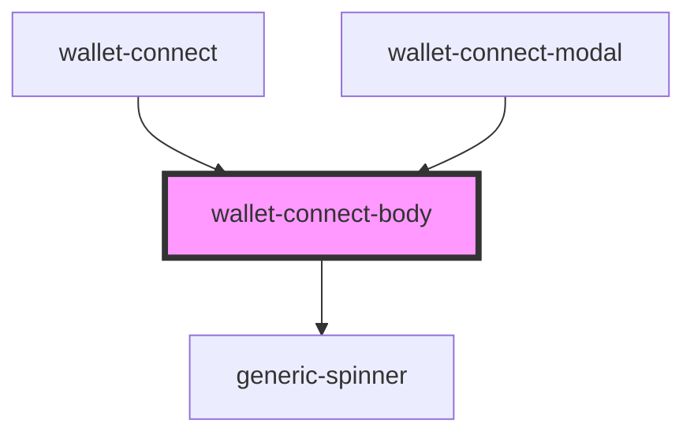

# wallet-connect-body

<!-- Auto Generated Below -->

## Properties

| Property      | Attribute     | Description | Type     | Default |
| ------------- | ------------- | ----------- | -------- | ------- |
| `description` | `description` |             | `string` | `''`    |
| `qrCodeSvg`   | `qr-code-svg` |             | `string` | `''`    |

## Dependencies

### Used by

 - [wallet-connect](..)
 - [wallet-connect-modal](..)

### Depends on

- [generic-spinner](../../../../common/generic-spinner)

### Graph

----------------------------------------------

*Built with [StencilJS](https://stenciljs.com/)*
