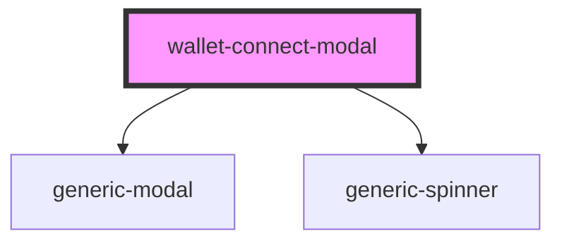

# wallet-connect-modal

<!-- Auto Generated Below -->

## Properties

| Property | Attribute | Description | Type                      | Default                |
| -------- | --------- | ----------- | ------------------------- | ---------------------- |
| `data`   | --        |             | `IWalletConnectModalData` | `{     wcURI: '',   }` |

## Methods

### `getEventBus() => Promise<IEventBus>`

#### Returns

Type: `Promise<IEventBus>`

## Dependencies

### Depends on

- [generic-modal](../../../common/generic-modal)
- [generic-spinner](../../../common/generic-spinner)

### Graph

---

_Built with [StencilJS](https://stenciljs.com/)_
