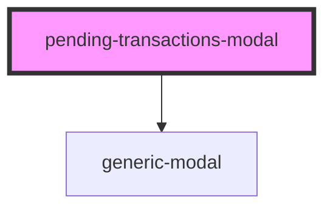

# pending-transactions-modal

<!-- Auto Generated Below -->

## Properties

| Property | Attribute | Description | Type                            | Default                                                        |
| -------- | --------- | ----------- | ------------------------------- | -------------------------------------------------------------- |
| `data`   | --        |             | `IPendingTransactionsModalData` | `{     isPending: false,     title: '',     subtitle: '',   }` |

## Methods

### `getEventBus() => Promise<IEventBus>`

#### Returns

Type: `Promise<IEventBus>`

## Dependencies

### Depends on

- [generic-modal](../../common/generic-modal)

### Graph

----------------------------------------------

*Built with [StencilJS](https://stenciljs.com/)*
