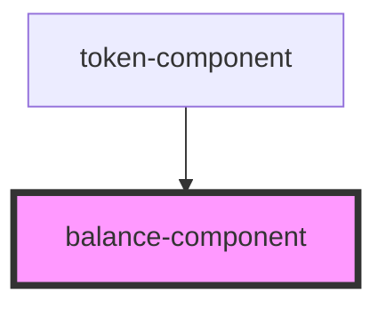

# mvx-balance

<!-- Auto Generated Below -->

## Properties

| Property   | Attribute   | Description | Type     | Default     |
| ---------- | ----------- | ----------- | -------- | ----------- |
| `amount`   | `amount`    |             | `string` | `''`        |
| `header`   | `header`    |             | `string` | `''`        |
| `ticker`   | `ticker`    |             | `string` | `''`        |
| `usdValue` | `usd-value` |             | `string` | `undefined` |

## Dependencies

### Used by

 - [token-component](../token-component)

### Graph

----------------------------------------------

*Built with [StencilJS](https://stenciljs.com/)*
