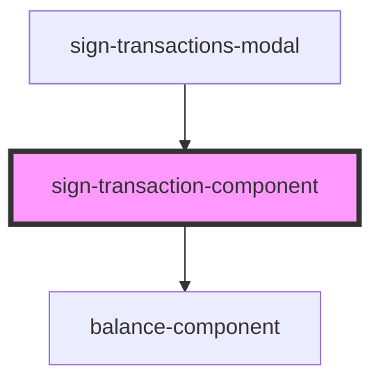

# sign-transaction

<!-- Auto Generated Below -->

## Properties

| Property | Attribute | Description | Type                                         | Default     |
| -------- | --------- | ----------- | -------------------------------------------- | ----------- |
| `data`   | --        |             | `ITransactionData & { onSign: () => void; }` | `undefined` |

## Dependencies

### Used by

 - [sign-transactions-modal](../..)

### Depends on

- [balance-component](../balance-component)

### Graph

----------------------------------------------

*Built with [StencilJS](https://stenciljs.com/)*
