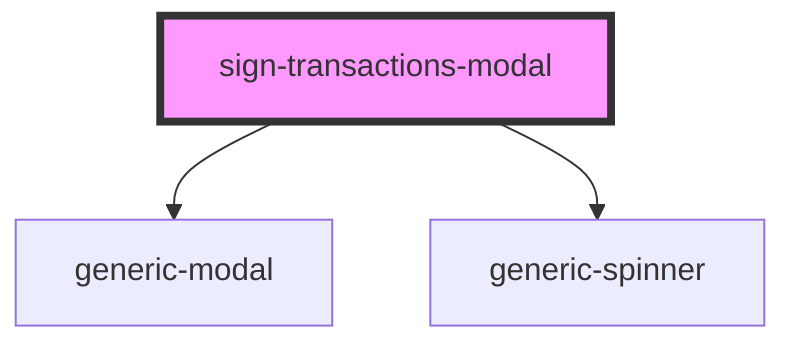

# ledger-connect-modal

<!-- Auto Generated Below -->

## Properties

| Property | Attribute | Description | Type                         | Default                                                                                                 |
| -------- | --------- | ----------- | ---------------------------- | ------------------------------------------------------------------------------------------------------- |
| `data`   | --        |             | `ISignTransactionsModalData` | `{     egldLabel: '',     feeLimit: '',     feeInFiatLimit: '',     total: 0,     currentIndex: 0,   }` |

## Methods

### `getEventBus() => Promise<IEventBus>`

#### Returns

Type: `Promise<IEventBus>`

## Dependencies

### Depends on

- [generic-modal](../../common/generic-modal)
- [generic-spinner](../../common/generic-spinner)

### Graph

----------------------------------------------

*Built with [StencilJS](https://stenciljs.com/)*
