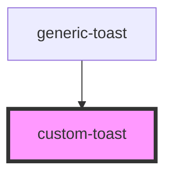

# custom-create-toast

<!-- Auto Generated Below -->

## Properties

| Property | Attribute | Description | Type              | Default     |
| -------- | --------- | ----------- | ----------------- | ----------- |
| `toast`  | --        |             | `IComponentToast` | `undefined` |

## Events

| Event               | Description | Type                  |
| ------------------- | ----------- | --------------------- |
| `handleDeleteToast` |             | `CustomEvent<string>` |

## Dependencies

### Used by

 - [generic-toast](../..)

### Graph

----------------------------------------------

*Built with [StencilJS](https://stenciljs.com/)*
