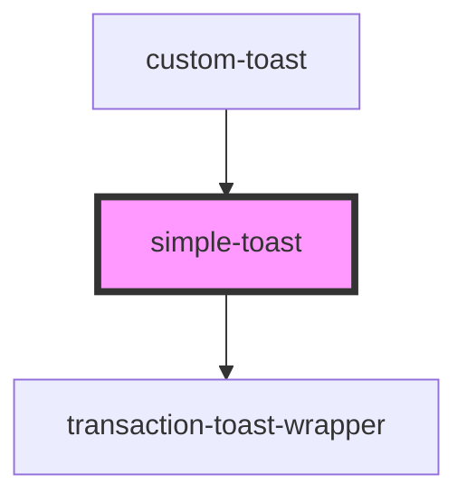

# simple-toast

<!-- Auto Generated Below -->

## Properties

| Property | Attribute | Description | Type               | Default     |
| -------- | --------- | ----------- | ------------------ | ----------- |
| `toast`  | --        |             | `ISimpleToastType` | `undefined` |

## Events

| Event               | Description | Type                |
| ------------------- | ----------- | ------------------- |
| `handleDeleteToast` |             | `CustomEvent<void>` |

## Dependencies

### Used by

 - [custom-toast](../..)

### Depends on

- [transaction-toast-wrapper](../../../transaction-toast/components/transaction-toast-wrapper)

### Graph

----------------------------------------------

*Built with [StencilJS](https://stenciljs.com/)*
