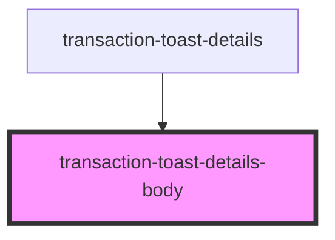

# transaction-toast-details-body

<!-- Auto Generated Below -->

## Properties

| Property           | Attribute           | Description | Type     | Default                   |
| ------------------ | ------------------- | ----------- | -------- | ------------------------- |
| `hash`             | `hash`              |             | `string` | `undefined`               |
| `status`           | `status`            |             | `string` | `undefined`               |
| `transactionClass` | `transaction-class` |             | `string` | `'transaction-container'` |

## Dependencies

### Used by

 - [transaction-toast-details](..)

### Graph

----------------------------------------------

*Built with [StencilJS](https://stenciljs.com/)*
