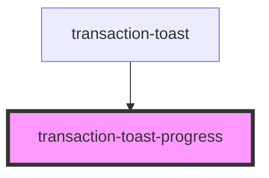

# transaction-toast-progress

<!-- Auto Generated Below -->

## Properties

| Property        | Attribute        | Description | Type      | Default                        |
| --------------- | ---------------- | ----------- | --------- | ------------------------------ |
| `endTime`       | `end-time`       |             | `number`  | `undefined`                    |
| `isCrossShard`  | `is-cross-shard` |             | `boolean` | `false`                        |
| `progressClass` | `progress-class` |             | `string`  | `'transaction-toast-progress'` |
| `startTime`     | `start-time`     |             | `number`  | `undefined`                    |

## Dependencies

### Used by

 - [transaction-toast](../..)

### Graph

----------------------------------------------

*Built with [StencilJS](https://stenciljs.com/)*
