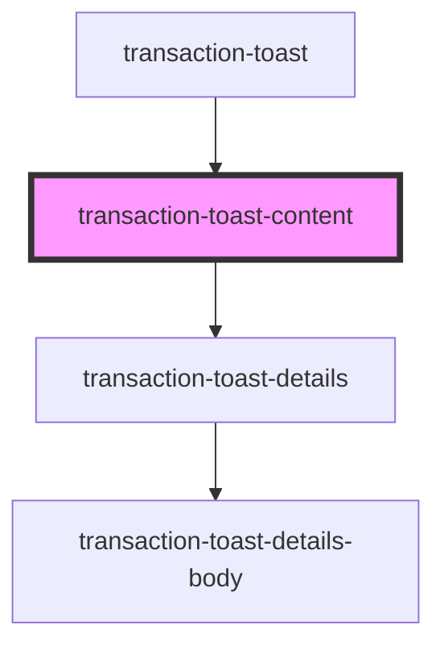

# transaction-toast-content

<!-- Auto Generated Below -->

## Properties

| Property                      | Attribute                       | Description | Type              | Default     |
| ----------------------------- | ------------------------------- | ----------- | ----------------- | ----------- |
| `processedTransactionsStatus` | `processed-transactions-status` |             | `any`             | `undefined` |
| `toastDataState`              | --                              |             | `IToastDataState` | `undefined` |
| `transactions`                | --                              |             | `ITransaction[]`  | `undefined` |

## Events

| Event         | Description | Type                |
| ------------- | ----------- | ------------------- |
| `deleteToast` |             | `CustomEvent<void>` |

## Dependencies

### Used by

 - [transaction-toast](../..)

### Depends on

- [transaction-toast-details](../transaction-toast-details)

### Graph

----------------------------------------------

*Built with [StencilJS](https://stenciljs.com/)*
