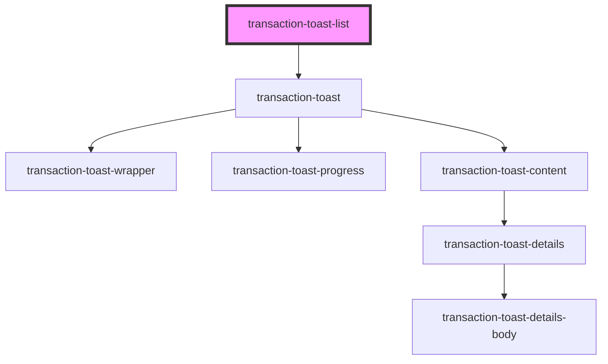

# transaction-toast-list

<!-- Auto Generated Below -->

## Properties

| Property | Attribute | Description | Type                  | Default     |
| -------- | --------- | ----------- | --------------------- | ----------- |
| `data`   | --        |             | `ITransactionToast[]` | `undefined` |

## Methods

### `getEventBus() => Promise<IEventBus>`

#### Returns

Type: `Promise<IEventBus>`

## Dependencies

### Depends on

- [transaction-toast](../..)

### Graph

----------------------------------------------

*Built with [StencilJS](https://stenciljs.com/)*
