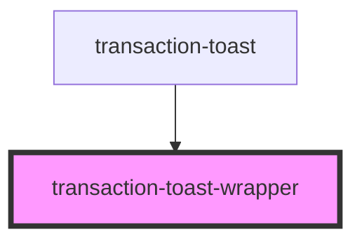

# transaction-toast-wrapper

<!-- Auto Generated Below -->

## Properties

| Property       | Attribute       | Description | Type     | Default                       |
| -------------- | --------------- | ----------- | -------- | ----------------------------- |
| `wrapperClass` | `wrapper-class` |             | `string` | `'transaction-toast-wrapper'` |
| `wrapperId`    | `wrapper-id`    |             | `string` | `undefined`                   |

## Dependencies

### Used by

 - [transaction-toast](../..)

### Graph

----------------------------------------------

*Built with [StencilJS](https://stenciljs.com/)*
