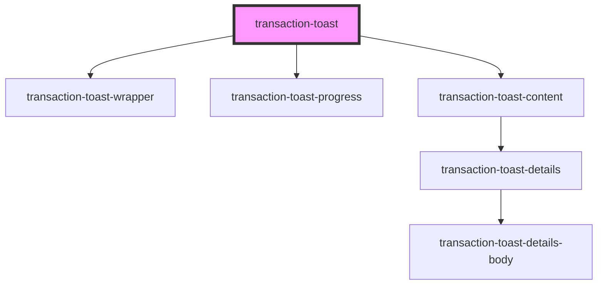

# transaction-toast

<!-- Auto Generated Below -->

## Properties

| Property                      | Attribute                       | Description | Type                        | Default     |
| ----------------------------- | ------------------------------- | ----------- | --------------------------- | ----------- |
| `processedTransactionsStatus` | `processed-transactions-status` |             | `any`                       | `''`        |
| `toastDataState`              | --                              |             | `IToastDataState`           | `undefined` |
| `toastId`                     | `toast-id`                      |             | `string`                    | `''`        |
| `transactionProgressState`    | --                              |             | `ITransactionProgressState` | `undefined` |
| `transactions`                | --                              |             | `ITransaction[]`            | `[]`        |
| `wrapperClass`                | `wrapper-class`                 |             | `string`                    | `undefined` |

## Events

| Event               | Description | Type                  |
| ------------------- | ----------- | --------------------- |
| `handleDeleteToast` |             | `CustomEvent<string>` |

## Dependencies

### Depends on

- [transaction-toast-wrapper](./components/transaction-toast-wrapper)
- [transaction-toast-progress](./components/transaction-toast-progress)
- [transaction-toast-content](./components/transaction-toast-content)

### Graph

----------------------------------------------

*Built with [StencilJS](https://stenciljs.com/)*
