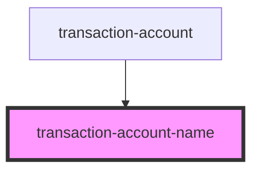

# transaction-account-name

<!-- Auto Generated Below -->

## Properties

| Property      | Attribute      | Description | Type     | Default     |
| ------------- | -------------- | ----------- | -------- | ----------- |
| `address`     | `address`      |             | `string` | `undefined` |
| `class`       | `class`        |             | `string` | `undefined` |
| `dataTestId`  | `data-test-id` |             | `string` | `undefined` |
| `description` | `description`  |             | `string` | `undefined` |
| `name`        | `name`         |             | `string` | `undefined` |

## Dependencies

### Used by

 - [transaction-account](../..)

### Graph

----------------------------------------------

*Built with [StencilJS](https://stenciljs.com/)*
