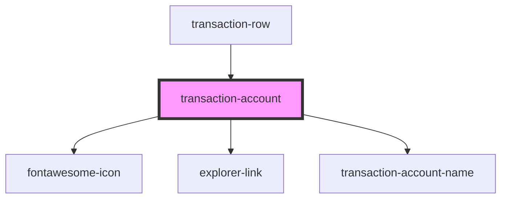

# transaction-account

<!-- Auto Generated Below -->

## Properties

| Property             | Attribute              | Description | Type                     | Default                 |
| -------------------- | ---------------------- | ----------- | ------------------------ | ----------------------- |
| `account`            | --                     |             | `ITransactionAccount`    | `undefined`             |
| `class`              | `class`                |             | `string`                 | `'transaction-account'` |
| `dataTestId`         | `data-test-id`         |             | `string`                 | `undefined`             |
| `scope`              | `scope`                |             | `"receiver" \| "sender"` | `undefined`             |
| `showLockedAccounts` | `show-locked-accounts` |             | `boolean`                | `false`                 |

## Dependencies

### Used by

 - [transaction-row](../transaction-row)

### Depends on

- [fontawesome-icon](../../../fontawesome-icon)
- [explorer-link](../../../explorer-link)
- [transaction-account-name](./components/transaction-account-name)

### Graph

----------------------------------------------

*Built with [StencilJS](https://stenciljs.com/)*
