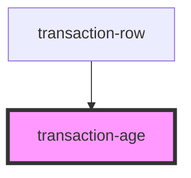

# my-component

<!-- Auto Generated Below -->

## Properties

| Property  | Attribute | Description | Type     | Default             |
| --------- | --------- | ----------- | -------- | ------------------- |
| `age`     | `age`     |             | `string` | `undefined`         |
| `class`   | `class`   |             | `string` | `'transaction-age'` |
| `tooltip` | `tooltip` |             | `string` | `undefined`         |

## Dependencies

### Used by

 - [transaction-row](../transaction-row)

### Graph

----------------------------------------------

*Built with [StencilJS](https://stenciljs.com/)*
