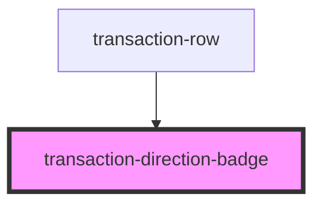

# transaction-direction-badge

<!-- Auto Generated Below -->

## Properties

| Property    | Attribute   | Description | Type     | Default                         |
| ----------- | ----------- | ----------- | -------- | ------------------------------- |
| `class`     | `class`     |             | `string` | `'transaction-direction-badge'` |
| `direction` | `direction` |             | `string` | `undefined`                     |

## Dependencies

### Used by

 - [transaction-row](../transaction-row)

### Graph

----------------------------------------------

*Built with [StencilJS](https://stenciljs.com/)*
