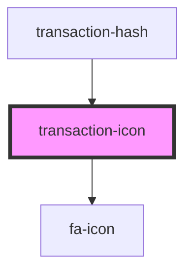

# my-component

<!-- Auto Generated Below -->

## Properties

| Property   | Attribute | Description | Type                   | Default              |
| ---------- | --------- | ----------- | ---------------------- | -------------------- |
| `class`    | `class`   |             | `string`               | `'transaction-icon'` |
| `iconInfo` | --        |             | `ITransactionIconInfo` | `undefined`          |

## Dependencies

### Used by

 - [transaction-hash](../transaction-hash)

### Depends on

- [fa-icon](../../../fa-icon)

### Graph

----------------------------------------------

*Built with [StencilJS](https://stenciljs.com/)*
