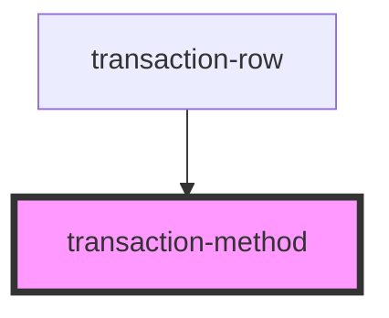

# my-component

<!-- Auto Generated Below -->

## Properties

| Property            | Attribute            | Description | Type     | Default                |
| ------------------- | -------------------- | ----------- | -------- | ---------------------- |
| `actionDescription` | `action-description` |             | `string` | `undefined`            |
| `class`             | `class`              |             | `string` | `'transaction-method'` |
| `method`            | `method`             |             | `string` | `undefined`            |

## Dependencies

### Used by

 - [transaction-row](../transaction-row)

### Graph

----------------------------------------------

*Built with [StencilJS](https://stenciljs.com/)*
