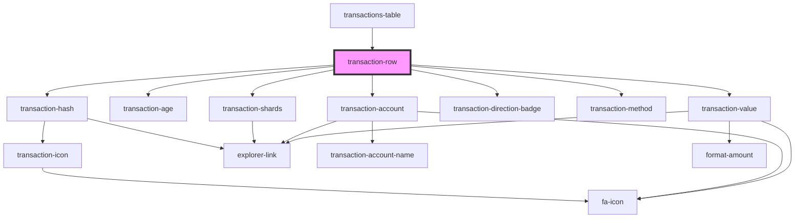

# transaction-row

<!-- Auto Generated Below -->

## Properties

| Property      | Attribute | Description | Type                    | Default             |
| ------------- | --------- | ----------- | ----------------------- | ------------------- |
| `class`       | `class`   |             | `string`                | `'transaction-row'` |
| `transaction` | --        |             | `ITransactionsTableRow` | `undefined`         |

## Dependencies

### Used by

 - [transactions-table](../..)

### Depends on

- [transaction-hash](../transaction-hash)
- [transaction-age](../transaction-age)
- [transaction-shards](../transaction-shards)
- [transaction-account](../transaction-account)
- [transaction-direction-badge](../transaction-direction-badge)
- [transaction-method](../transaction-method)
- [transaction-value](../transaction-value)

### Graph

----------------------------------------------

*Built with [StencilJS](https://stenciljs.com/)*
