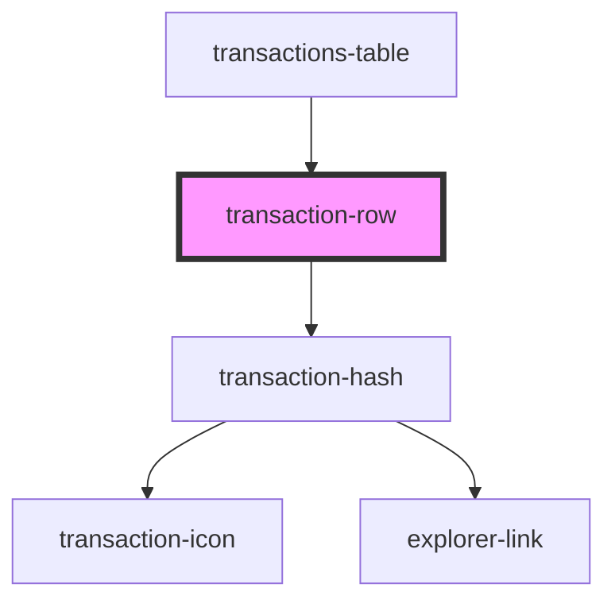

# transaction-row

<!-- Auto Generated Below -->

## Properties

| Property      | Attribute | Description | Type                    | Default     |
| ------------- | --------- | ----------- | ----------------------- | ----------- |
| `transaction` | --        |             | `ITransactionsTableRow` | `undefined` |

## Dependencies

### Used by

 - [transactions-table](../..)

### Depends on

- [transaction-hash](../transaction-hash)

### Graph

----------------------------------------------

*Built with [StencilJS](https://stenciljs.com/)*
